# Yummlyst

## Overview
Yummlyst is a meal recipe app that helps users explore random meals, search for meals by category, country, or ingredients, and manage their favorite and planned meals. The app integrates Firebase for authentication and supports offline functionality using a local database.

## Features
- **Authentication:**
  - Register with email and password via Firebase Authentication.
  - Log in with Google.
  - Guest mode available.

- **Meal Exploration:**
  - View random meals on the home screen.
  - Click on a meal to view details, including a tutorial video.

- **Search & Filtering:**
  - Search meals by **category, country, or ingredients**.
  - Filter search results by name.

- **Meal Management:**
  - Add meals to favorites for quick access.
  - Plan future meals by adding them to the meal plan.

- **Data Storage:**
  - **Room Database:** Local storage for favorite and planned meals.
  - **Firebase Realtime Database:** Sync favorites and planned meals across devices.

- **Offline Mode:**
  - View only favorite and planned meals when offline.

- **User Profile:**
  - View profile information.
  - Log out from the app.

## App Flow
1. **Splash Screen** → Login Screen → Register Screen (switchable).
2. After login/register → Home Screen (random meals).
3. Clicking on a meal → Meal Details Screen (meal info + video + options to add to favorites or plan).
4. Search meals by category, country, or ingredients → Filter results by name.
5. **Plan Screen:** View planned meals.
6. **Favorites Screen:** View favorite meals.
7. **Profile Page:** Manage account and log out.

## Technologies Used
- **Frontend:** Java (Android Development).
- **Architecture:** MVP (Model-View-Presenter).
- **Database:** Room SQL (local storage) & Firebase Realtime Database (cloud sync).
- **Authentication:** Firebase Authentication (Email/Password & Google Sign-In).
- **API:** Fetching meal data from an external API.

## Screenshots
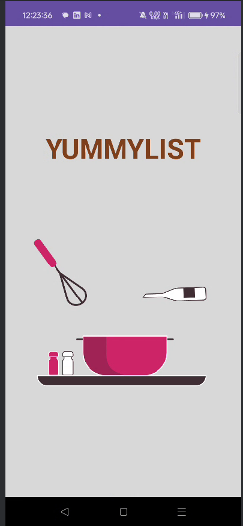
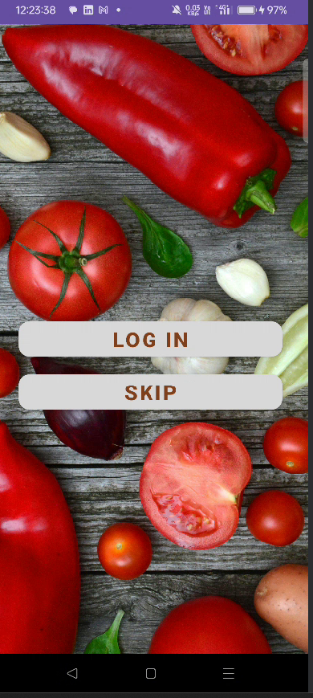
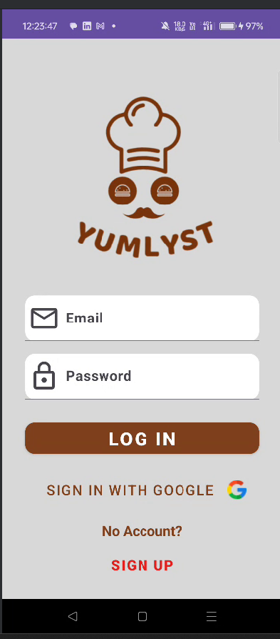
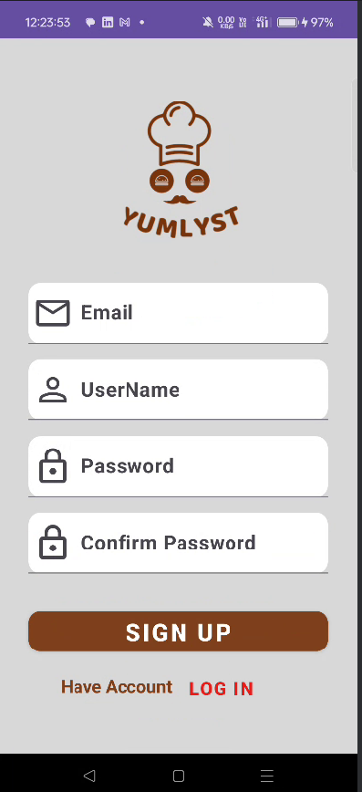
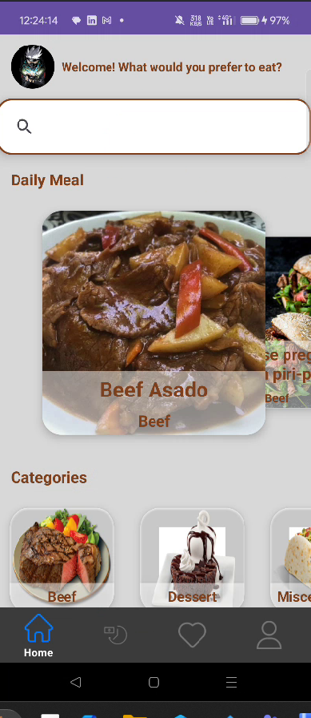
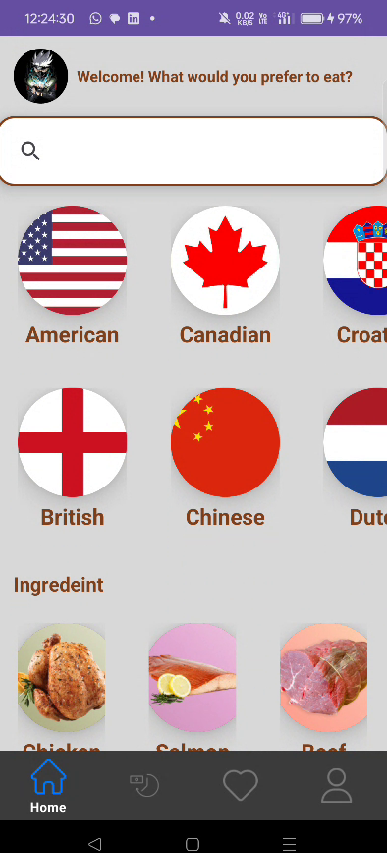
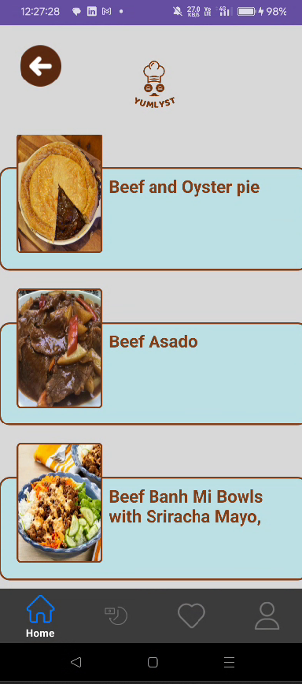
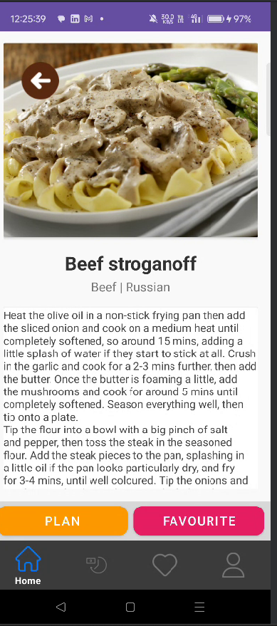
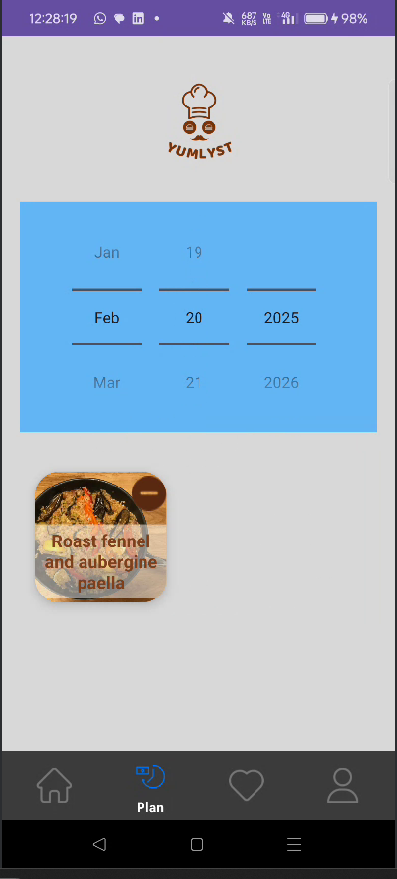
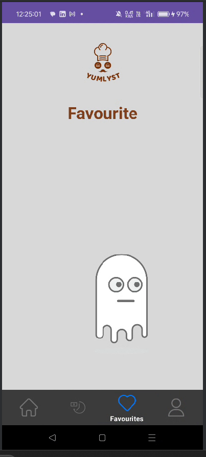
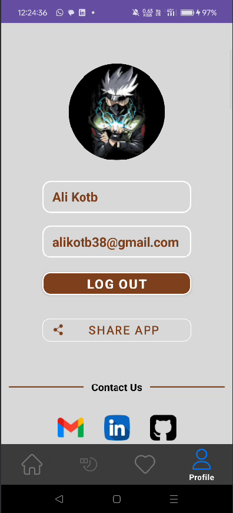

## Installation & Setup
1. Clone the repository.
2. Open the project in Android Studio.
3. Configure Firebase authentication and database.
4. Run the app on an emulator or physical device.

## Contact
For any inquiries, connect with me on **LinkedIn**: [Your LinkedIn Profile](#)

## License
This project is open-source and available for personal and educational use.
